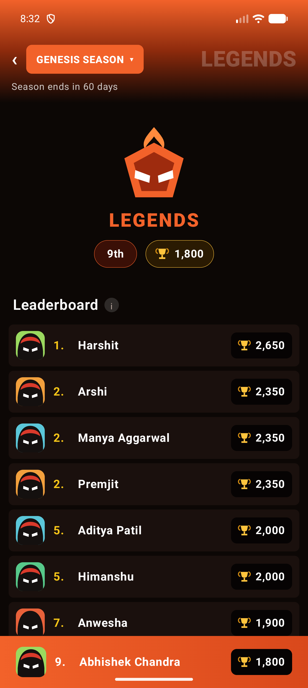
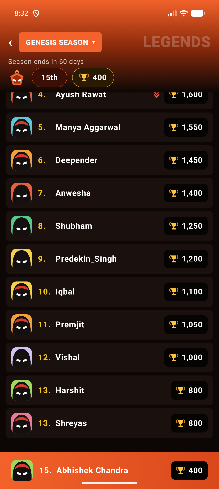

# Real-Time Leaderboard

A live tournament leaderboard for a mobile gaming platform. A simulated match engine keeps emitting
score events, and a separate leaderboard module ranks them as they arrive.

The list updating isn't the hard part. The work went into deciding where each piece of logic
belongs. Ranking rules sit in a plain Kotlin module with tests. Lifecycle ownership sits at the
composition root. The UI only draws what it's given.

<p align="center">
  
  
</p>

<p align="center"><em>
Live captures. The left one catches the ranking rules working: three players tied on 2,350 share
rank 2, so the next is rank <strong>5</strong>. Two more tie on 2,000 at rank 5, and the next is
rank <strong>7</strong>. Your own row sits in the list like anyone else's, and a copy docks to the
bottom only while it's scrolled off screen.
</em></p>

---

## Running it

```bash
./gradlew build     # everything: ktlint, detekt, lint, 88 tests, assemble
```

Or open in Android Studio and hit Run. JDK 21, Gradle 9.5, AGP 9.3, Kotlin 2.2.10, `minSdk 24`.
`compileSdk 37` downloads on first build. Nothing to configure: no keys, no backend, no network.

**On scope.** The brief budgets 5–7 hours and there's more here than that. The first pass was the
assignment as briefed. A second pass fixed six of my own code-review findings and rebuilt the UI to
match the reference video. Everything is justified, but not all of it is necessary, and
[Deferred, deliberately](#shipping-this-in-7-days) is my own list of what I'd cut first.

---

## The modules

```
┌─────────────────────┐     ┌───────────────────────┐     ┌────────────────────────┐
│ :engine             │     │ :leaderboard          │     │ :app                   │
│ Kotlin/JVM          │     │ Kotlin/JVM            │     │ Android + Compose      │
│                     │     │                       │     │                        │
│ ScoreEngine         │     │ LeaderboardEngine     │     │ MatchController ───────┼─ wires the two
│  └ Flow<ScoreEvent> │     │  └ Flow<Leaderboard…> │     │ LeaderboardViewModel   │
│ SimulatedScoreEngine│     │ LeaderboardReducer    │     │ LeaderboardScreen      │
│ MatchConfig, Player │     │ RankingRules  ← pure  │     │ AppContainer           │
└─────────────────────┘     └───────────────────────┘     └────────────────────────┘
        emits ScoreEvent ──────► (adapter in :app) ──────► consumes ScoreUpdate
```

| Module | Owns | Knows nothing about |
|---|---|---|
| `:engine` | The roster, and generating score events on a seeded schedule | Ranking, Android, UI |
| `:leaderboard` | Ranking rules, tie handling, incremental board state | Where scores come from, Android, UI |
| `:app` | Wiring, lifecycle, presentation | The internals of either domain module |

**Neither domain module depends on the other.** `:leaderboard` declares its own input type,
`ScoreUpdate`, and never imports the engine's `ScoreEvent`. The adapter is one function in `:app`:

```kotlin
fun ScoreEvent.toScoreUpdate() = ScoreUpdate(playerId, displayName, totalScore)
```

That function is the whole cost of keeping them apart. The leaderboard can be driven by the
simulator, a WebSocket feed, a REST poll or a test fixture. None of them require it to be
recompiled, or even to know they exist.

Both domain modules are plain Kotlin/JVM, not Android libraries. A `Context`, `View` or `Bundle`
can't leak into them because those classes aren't on the compile classpath. Their tests are ordinary
JUnit: **88 tests in about ten seconds, no emulator**, including the Compose UI tests, which run
under Robolectric.

### The match lifecycle

`MatchController` decides when a match may run:

```
Idle ──start()──► Running ──pause()──► Paused ──resume()──► Running
 ▲                   │                    │                    │
 └──── stop() ───────┴────────────────────┘        (stream ends) ▼
                                                            Finished ──start()──► Running
```

`pause()` keeps the standings and the engine's position, parking the producer on a suspension point
so nothing is scheduled. `stop()` throws the match away. That distinction is why the class exists:
backgrounding has to pause, because only pausing keeps a cold seeded engine where it was.

---

## Where the ranking logic lives

In `:leaderboard`, as pure functions in `RankingRules` plus an incremental `LeaderboardReducer`. Not
in the ViewModel, and not in the UI.

1. Order by score, descending.
2. Equal scores share a rank.
3. The rank after a tie skips by the size of the tie group. `100, 100, 90` ranks `1, 1, 3`, never
   `1, 1, 2`.
4. Ties break by `playerId` ascending, for display order only.

Rule 4 is the easy one to miss. Without a deterministic tiebreak, two players on the same score swap
places on every emission and the list jitters. Animation tuning can't fix that. It has to be fixed
in the ordering.

Rules 2 and 3 are one expression:

```kotlin
fun rankAt(index: Int, score: Long, previousScore: Long?, previousRank: Int): Int =
    if (previousScore != null && previousScore == score) previousRank else index + 1
```

Why not the ViewModel? Testing it would then need a ViewModel, a coroutine test rule and eventually
an Android runtime. A second screen would either duplicate the logic or force a shared base class.
Ranking belongs to the domain.

### The reducer

Re-sorting on every event is correct, and fine for 15 players. I didn't do it, for a reason about
frames rather than CPU. A full `sortedWith` allocates `n` new row objects. None are referentially
equal to the old ones, so Compose can't skip a single `LazyColumn` item and the whole visible list
recomposes on every tick.

`LeaderboardReducer` moves one player instead: remove, then binary-insert. It re-ranks only the
affected window, with an early exit. Rows outside that window stay the same instances, which lets
Compose skip them.

The early exit is provable. `rank[i]` depends only on `i`, `score[i]`, `score[i-1]` and `rank[i-1]`,
so once a recomputed rank past the moved window matches what's stored, nothing after it can differ.

That's the sort of cleverness that deserves suspicion. A property test runs 5,000 randomised
updates, checking the incremental state against a from-scratch `RankingRules.rank()` after every
one. Deltas are tiny (1–3) so players collide constantly, because ties are where this breaks.
`MatchIntegrationTest` then drives a full match through the real engine and real leaderboard,
checking the invariants on all 5,001 snapshots.

I confirmed both tests actually bite by mutating the early-exit condition. They failed immediately,
and passed again when I put it back.

---

## Performance and lifecycle

**Not blocking the UI thread.** Generation and ranking run on `Dispatchers.Default`, owned by an
application-scoped scope. `MatchController` launches the pipeline on an injected dispatcher, so
ranking can't land on `Main` whatever scope a caller passes. The ViewModel's mapping is
`flowOn(Dispatchers.Default)` too, since `viewModelScope` is `Main.immediate`. The engine paces
itself with `delay()` in a coroutine, never a timer: the list changes because the engine emitted,
not because the UI ticked.

**Not recomposing unnecessarily.** Four mechanisms:

1. Nothing emits when nothing changed. `apply()` returns `false` for a repeated total, so the
   emission never leaves the domain.
2. Row instances are reused, which lets `LazyColumn` skip untouched items. A unit test asserts
   `assertSame` on untouched rows.
3. Stability is declared. `compose_compiler_config.conf` marks the leaderboard models stable,
   otherwise classes from a non-Compose module count as unstable and item skipping dies. Verified
   from the compiler report, not assumed.
4. Animations run in the draw and layout phases. The flash and scale read an `Animatable` only
   inside `graphicsLayer {}` and `drawBehind {}`, so a 700 ms highlight costs zero recompositions.
   The collapsing header and the docking row use `layout {}` and `derivedStateOf` for the same
   reason.

The counting score text does have to recompose per frame, since text can't be drawn in the draw
phase, so it's isolated into its own composable.

**Memory leaks.** The domain modules can't hold Android references. The one long-lived subscription
belongs to `MatchController`, owned by an application-scoped scope holding no `Context`. The UI uses
`collectAsStateWithLifecycle()`. `LeaderboardReducer` is built inside the flow builder, confining
its state to one collection.

**Rotation.** The leaderboard is application-scoped, so the Activity is destroyed and rebuilt while
the match carries on. The new ViewModel seeds from current standings, so the first frame shows live
data. Checked on device: scores carried on from 440 to 528 with no reset.

The layout adapts too. The hero panel is 260dp of branding, which on a landscape phone would leave
room for about one row, so below 560dp of height it's dropped and the compact summary in the season
bar carries your rank instead. Keyed off available height rather than an orientation flag, because
split screen and a folded inner display get short the same way.

**Backgrounding.** The match pauses and resumes where it left off, scheduling nothing meanwhile.
Getting there meant separating two concerns. *Sharing* decides there's one match that never loses
state, which is why `SharingStarted.Eagerly` stays. `WhileSubscribed` over a cold seeded source
restarts the upstream from zero while the replay cache still holds the old scores. The obvious fix
for the battery problem is therefore a correctness bug. *A lifecycle gate* decides when that match
may work.
`scoreEvents(runWhile:)` parks before scheduling each tick, driven by `MatchController.pause()` and
`ProcessLifecycleOwner`. The gate sits before the `delay`, since filtering downstream would look
identical while still waking the device every 0.5–2s. Measured on device across 50s and 120s
backgrounded: one in-flight tick each time, nothing lost.

**Scaling to 1,000.** The design holds. The reducer's array shift is `O(n)` per event, microseconds
at that size. I'd add `sample(~100ms)` so the UI updates at a readable rate rather than at feed
rate, since past roughly 10 Hz extra updates stop being information.

**Scaling to 100,000.** The answer changes in kind. No client should hold or rank 100K rows. Ranking
moves server-side, where it has to be authoritative anyway and a Redis sorted set gives `ZREVRANK`
in `O(log n)`. The client subscribes to a window: top ~50, a slice around your rank, and your own
row. The wire format becomes deltas, not snapshots, batched into fixed ticks so client work is
bounded by tick rate rather than tournament size. `LeaderboardEngine`'s interface barely changes,
which is much of why ranking sits behind a module boundary.

---

## Decisions and trade-offs

**Compose over XML.** This screen is a list whose *order* changes several times a second, which is
where the two toolkits differ. Reordering in a `RecyclerView` means `DiffUtil` plus payload plumbing
and `ItemAnimator` config; in Compose it's a stable `key` and `Modifier.animateItem()`. Compose
also lets me push animation into the draw and layout phases. Skipping is *measurable* from the
compiler reports, which is how the claims above got verified. XML would win for a static screen, or
a team with no Compose experience.

| Decision | Gave up | Got |
|---|---|---|
| Two independent domain modules with a mapping function | A little boilerplate, one extra type | No coupling; either side replaceable on its own |
| Kotlin/JVM instead of Android library modules | Can't use Android types in the domain, which is the point | Fast tests, a boundary the compiler enforces |
| Incremental reducer over full re-sort | More code, needs a property test to be trustworthy | Item-level skipping, and a shape that survives growth |
| Manual DI container | Hilt's scoping and multi-module ergonomics | No plugin, no annotation processing, for three objects |
| App-scoped match, eagerly shared, paused by a lifecycle gate | One more moving part than plain `WhileSubscribed` | Rotation-proof state and no background drain, without the score-collapse bug |
| Fixed palette instead of `MaterialTheme` | Dynamic colour | A game surface that looks like the reference, not like the user's wallpaper |
| Canvas-drawn avatars and trophy | Real artwork | Obvious stand-ins, no invented assets, scales to any density |

---

## Code review simulation

Assume a mid-level engineer wrote this. Nine real findings against this codebase, categorised, with
the reasoning that makes each worth raising. Six are fixed; I kept them all, because what a review
catches is the point. Two are open by choice.

| # | Category | Finding | Status |
|---|---|---|---|
| 1 | Must Fix | The match never stops, draining battery in the background | Fixed |
| 2 | Must Fix | `AppContainer` creates a `CoroutineScope` and never cancels it | Fixed |
| 3 | Must Fix | `AnimatedScore` narrows `Long` to `Int` | Fixed |
| 4 | Improvement | `toUiState` allocates a filtered list on every emission | Fixed |
| 5 | Improvement | `LeaderboardReducer.insert()` is `O(n)` while advertising windowed updates | **Open** |
| 6 | Improvement | Season chrome is hard-coded, unlocalisable string literals | **Open** |
| 7 | Tech Debt | There is no match lifecycle | Fixed |
| 8 | Tech Debt | The UI is only verified by eye | Fixed |
| 9 | Must Fix | *(from fixing #7)* `MatchController` commands aren't thread-safe | Fixed |

**1. The match never stops.** `SharingStarted.Eagerly` on an app-scoped flow meant the engine kept
generating while backgrounded, forever, for a screen nobody was looking at. "A live tournament does
not pause" is fine reasoning for a server. This is a phone.
> Fixed by the lifecycle gate described above. Worth noting the obvious fix, `WhileSubscribed`,
> would have introduced a correctness bug instead.

**2. `appScope` is created and never cancelled.** Defensible for a process singleton, but nothing
enforced that it was one. A test or a future multi-window path would silently start a second match
with no handle to stop it. A comment isn't a lifetime.
> Fixed: the container is `AutoCloseable`. I didn't override `Application.onTerminate` to call it,
> because that doesn't run on real devices and would be cleanup code guaranteeing nothing.

**3. `AnimatedScore` narrows `Long` to `Int`.** The domain models score as `Long` because a long
tournament exceeds `Int`. Past 2.1B this doesn't degrade, it wraps: 2,147,484,647 renders as
−2,147,482,649.
> Fixed. Every Compose animation primitive is `Float`-backed, and `Float` stops resolving
> consecutive integers above ~16.7M, so `animateFloatAsState` only swaps a wrap for silent stutter.
> The counter animates a normalised progress and interpolates in `Long`/`Double`.

**9. `MatchController`'s commands aren't thread-safe.** *(Raised by fixing #7. A fix that introduces
a constraint deserves reviewing too.)* Each command is a check-then-act across four fields. Two
concurrent `start()` calls could both see `Idle`, both launch, and orphan a job forever.
> Fixed with a reentrant lock over every command and the completion callback. A lock rather than an
> actor channel keeps commands synchronous, so `status.value` is correct when `pause()` returns.
> Proved by removing the lock: 64 threads firing at once left an orphan still writing after
> `stop()`, and all four concurrency tests failed.

**4. `toUiState` allocates a filtered list on every emission.** It copied the whole board per update
to drop one row. Noise at 15 rows; a per-event allocation on the hot path at 1,000, undoing the work
the reducer goes to such lengths to avoid.
> Fixed, then partly superseded. The domain now hands over `selfIndex`, known in `O(1)`, with `self`
> derived from it. The docking behaviour later removed the need for the rest, so the view class was
> deleted rather than kept warm for a caller that no longer exists.

**5. `insert()` is `O(n)` while the class advertises itself as incremental.** Adding a player
re-indexes the whole tail. It's correct and happens once per player, so it isn't a bug, but the KDoc
promises windowed updates and this path isn't one. A reader who trusts the comment gets a surprise.
> **Open.** The cost is bounded by roster size, and the honest fix wants a different index structure
> than the hot path does.

**6. Season chrome is hard-coded string literals.** `"GENESIS SEASON"`, `"Season ends in 60 days"`.
That's content, not decoration: it changes per season, isn't localised, and the countdown will be
wrong tomorrow.
> **Open.** The screen can't be translated until this moves into a `Season` model with strings in
> resources. First thing I'd do for real users.

**7. There is no match lifecycle.** Nothing could start, stop, restart or reseed a match, and there
was no way to ask whether one was running. Pause existed only as a `Flow<Boolean>` threaded through
a constructor. A season boundary or a "rematch" button would hit `stateIn` head-on.
> Fixed. `MatchController` owns the state machine above. Standings moved to a `MutableStateFlow`,
> because `stateIn` ties a flow's life to a scope at construction while a held job can be cancelled
> and replaced. 16 tests cover it, 4 of them concurrent.

**8. The UI is only verified by eye.** The domain was well covered; the screen had nothing. Every
animation was checked by screenshot. This project already contains one rendering bug that got
through that way: a row briefly showed a new rank beside a score that hadn't counted up yet, and
looked mis-ranked.
> Fixed with Compose UI tests under Robolectric, so they sit in the same CI step as everything else.
> They earned it immediately: the "waiting for the first score" state didn't exist, having been
> dropped in a redesign. Nobody spots that by looking, because the first score lands in a second.

---

## Shipping this in 7 days

**Non-negotiable.** Correct ranking including ties, with tests, because a leaderboard that's subtly
wrong is worse than none: nobody notices until a payout is disputed. Server-authoritative scores.
Stable ordering, since a jittering list reads as broken however correct it is. Correct rotation and
backgrounding. No main-thread blocking under live updates.

**Deferred, deliberately.** The incremental reducer: I'd ship the obvious re-sort, keep the property
test, and swap the implementation later. The test makes that swap safe, which is why the *test* is
non-negotiable and the *optimisation* isn't. Also the movement arrows, count-up and flash; the
collapsing header; multi-season support; screenshot tests. The rule is cut scope, not correctness.
Everything deferred can be added later without redesigning anything.

**Splitting the work**, along the seams already in the module graph so nobody collides.

- **Junior:** `:app` presentation against a `Flow<LeaderboardState>` fixture, so they're never
  blocked on the engine or backend. Clear acceptance criteria, visible output, and a good review
  conversation waiting about deferred state reads in Compose.
- **Mid-level:** `:leaderboard` and the wiring. Ranking rules, the reducer, the property test,
  `MatchController`. Self-contained, easy to specify tightly, testable without a device.
- **Me:** the module contracts up front, so the other two work in parallel from hour one. The
  lifecycle and threading calls, cheap now and expensive to retrofit. Negotiating the server
  contract: window size, tick rate, delta format, what the client may compute. Anti-cheat posture,
  including saying no to client-authoritative scoring when it's faster to build. Reviews, and
  pairing on the reducer, the one piece where clever and wrong look identical.

---

## Anti-cheat

The client must never be authoritative. This project's engine lives on-device only because it stands
in for a backend, and that's the one thing that must not ship.

- **Scores computed and signed server-side.** The client submits gameplay inputs or match results,
  never a score. "I have 9,999,999 points" isn't a message the protocol has.
- **Sanity bounds per event and per second.** Anything over is dropped and flagged, not clamped: a
  clamped cheat is an undetected cheat.
- **Replay defence.** `ScoreEvent` already carries a monotonic `sequence`; server-side that becomes
  a per-session nonce, and out-of-order or duplicate events are discarded.
- **Plausibility over time.** Impossible improvement curves and superhuman consistency show up in
  aggregate even when every single event is legal.
- **Finals get replay validation** and a settlement delay so flagged results can be held.
- Client-side obfuscation is friction, not a security boundary, and shouldn't be budgeted as one.

## Production readiness

Beyond the open review items:

- **Observability.** Frame timing via Macrobenchmark and JankStats, event-to-render latency,
  dropped-event counts. Right now "is it smooth?" is answered by looking at it.
- **A stated backpressure policy.** `StateFlow` conflation drops intermediate states today. That's
  correct for a leaderboard, but it's an emergent property rather than a decision.
- **Reconnect and resync** on sequence gaps, without the visible score collapse described above.
- **Real error and empty states.** There's one non-happy path today.
- **Accessibility.** Rank movement is colour and a glyph alone, which fails TalkBack entirely.
- **A Baseline Profile**, staged rollout behind a flag, and R8, which is off by template default.

## Quality gates

`./gradlew build` runs ktlint, detekt, 88 tests, Android Lint and assemble, fastest signal first.
Style lives in `.editorconfig`, so the IDE formatter and CI can't disagree.
`config/detekt/detekt.yml` records only the deliberate deviations and why. `MagicNumber` is off
under `ui/`, where dp offsets and Bézier coordinates are the content, and stays on in the domain
modules. CI runs the same thing on every push.

## What I'd do next

1. Screenshot tests, now that behavioural UI coverage exists.
2. Move the season model into resources and do a proper accessibility pass.
3. Replace the simulated engine with a WebSocket client behind the same `ScoreEngine` interface.
   That's the change this architecture was shaped to make cheap, and the real test of whether the
   module split was worth it.

## Honest notes

- The avatars, trophy and league emblem are drawn with `Canvas`, not real artwork. I didn't have the
  game's assets and preferred obvious stand-ins to invented PNGs that look official.
- The season name and countdown are hard-coded chrome (review item 6). The rank and trophy count in
  the header are live, from the domain.
- The reference video's "718th" isn't reproduced literally. The header shows your real current rank,
  which seemed more useful than a static number.
